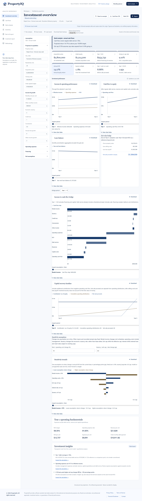
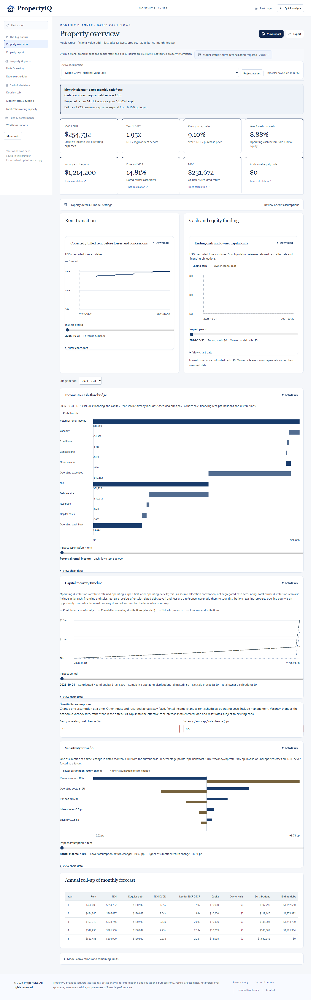
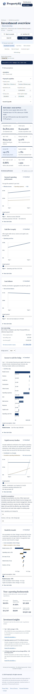

# PropertyIQ

PropertyIQ is a free, browser-local tool for understanding multifamily property cash flows and financing. Quick analysis turns acquisition, income and expense assumptions into annual returns, debt schedules and sensitivity tables. Monthly planner adds leasing, construction, refinancing, funding and investor scenarios. Built with React, TypeScript and Vite, it works without accounts, paid APIs or a backend. Uploaded workbooks stay in the browser.

Public deployment is pending. Run locally below, then choose **Try with sample property**. [Cloudflare Pages launch guide](DEPLOYMENT.md).





## Features

- Quick analysis with 3–10 year holds, separate tax/insurance growth, capital inflation and optional sale-tax reassessment.
- Full amortization after interest-only by default; selectable original-term amortization, 30/360 or actual/360 interest, and LTV/DSCR/debt-yield loan constraints.
- Sensitivity anchored to going-in cap rates, with a target-return color scale, labeled base case and a downside takeaway.
- Income-to-cash-flow bridge, configurable one-assumption sensitivity tornado and capital recovery timeline, with keyboard/touch inspection, data tables and PNG/SVG/CSV downloads.
- CSV/XLSX rent-roll import, explicit review and application, local snapshots, portable backups including evidence files, and printable investment briefs.
- Monthly leasing, expenses, capital budgets, debt, investor returns, actuals, decision tools, evidence and workbook reconciliation. All existing tools remain available through primary navigation, More tools and search.
- Editable setup defaults, live extraction preview, exact project links, accessible chart legends and mobile results before assumptions.

## How the math is validated

The fictional Maple Grove value-add sample has $254,732 Year 1 NOI, a 41.65% operating expense ratio, taxes equal to 2% of acquisition price, and an exit cap 62.5 bps above its going-in cap. Its calculated annual IRR is **14.17%**. These are illustrative assumptions, not a sourced market deal.

Independent 40-digit Python Decimal calculations provide literal benchmark expectations for debt payments, balances, operating income, sale proceeds and returns. Both engines receive identical assumptions in parity tests: annual NOI, debt payoff, net sale and annual cash-flow IRR reconcile. Monthly XIRR is **14.81%** because distributions arrive monthly and returns use actual dates; this difference is disclosed rather than hidden.

The latest full run passes **212 regression tests**. Finance coverage gates require at least 90% statements, lines and functions, and 80% branches. 91 browser checks pass across Chromium, Firefox and WebKit. They cover desktop and 390×844 narrow-screen flows, imports, edits, storage, routing, every monthly tool and serious axe accessibility violations. GitHub Actions repeats the checks on pushes and pull requests. See [verification evidence](TESTING.md) and [financial conventions](METHODOLOGY.md).

The included examples and sample workbooks are fictional. Their provenance persists through edits, duplication and backups. To check your own workbook, use the [mapping checklist and discrepancy template](RECONCILIATION.md); private project data stays in your browser.

## Run locally

Use Node.js 22.12 or later and pnpm 11.25.0:

```sh
pnpm install --frozen-lockfile
pnpm dev
```

To verify and build:

```sh
pnpm typecheck
pnpm lint
pnpm test:coverage
pnpm build
pnpm exec playwright install chromium firefox webkit
pnpm test:e2e
```

`pnpm preview` opens a built-site preview. Browser tests use the same security headers as the static deployment through `scripts/preview.mjs`. Reproduce the independent calculations with `python scripts/decimal_benchmarks.py`.

## Limitations

- Synthetic benchmarks do not replace reconciliation to real loan documents and underwriting workbooks.
- Annual IRR and dated monthly XIRR have different cash-flow timing. Tax, construction and investor scenarios rely on entered assumptions.
- Actual/360 models full calendar months with nominal scheduled principal; it does not infer lender stub periods or penny-rounding rules.
- Projects are stored locally; clearing browser data removes them. Export backups before changing devices.
- Chromium, Firefox and Playwright WebKit pass desktop and narrow-screen checks. These are automated browser tests, not physical-device certification. Actual Cloudflare response headers still require deployment checks.

[Methodology](METHODOLOGY.md) · [Deployment](DEPLOYMENT.md) · [Reconciliation](RECONCILIATION.md) · [Changelog](CHANGELOG.md) · [Contact](mailto:abc@gmail.com)
